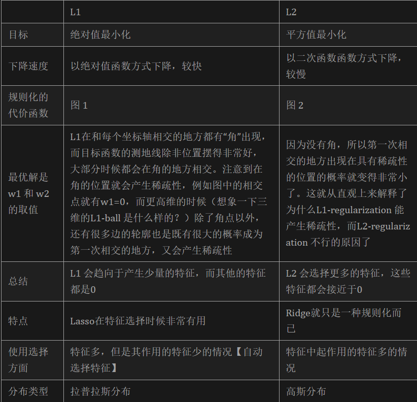

# 深度学习基础概念

## 一、过拟合/欠拟合

1. 过拟合的表现形式：高方差。训练集和测试集的误差呈现较大差异，模型泛化能力差。

2. 过拟合的可能原因：① 训练集规模太少；② 训练集与测试集分布不一致；③ 训练集中存在噪声；④ 模型复杂度过高

3. 过拟合的解决办法：① 实现样本尽可能均衡；② 清洗噪声数据；③ 降低模型复杂度；④ 正则化，如 L1、L2、dropout 等；⑤ 使用 bagging（如随机森林）；⑥ 进行特征选择与降维；⑦ 交叉检验，早停策略

4. 欠拟合的表现形式：高偏差。训练集和测试集误差都收敛但很高，模型拟合效果不佳。

5. 欠拟合的原因：模型没有充分学习到数据中的特征信息。

6. 欠拟合的解决办法：① 特征工程，增加更多的特征项；② 使用 boosting（如GBDT）；③ 提高模型复杂度；④ 减小正则化系数

7. 为什么 bagging 解决过拟合而 boosting 解决欠拟合？bagging的思想是通过有放回选取数据构成数据集，然后在该数据集上每次训练一个基分类器，最终将各个基分类的结果根据少数服从多数的原则得到投票一半以上的结果。假设某个样本被判错的概率一定，各个基分类器是独立的，因此被所有基分类器都判错的概率会随着基分类的数目增加而指数的减小，所以bagging可以防止过拟合，减少模型的方差。boosting是串行训练，每次都是根据上一个基分类的结果和标签的残差来训练，所以一步一步的串行训练后最终的偏差越来越小，可以防止欠拟合。

7. 为什么 PCA 不能用来避免过拟合：有监督学习拟合的是输入 x 到输出 y 之间的关系，但 PCA 仅考虑 x，考虑特征之间的相关性，因此降维之后的新特征可能抛弃了降维之前 x 中蕴含的与 y 的相关关系，破坏了 x 与 y 的可监督性。

## 二、正则化

1. 正则化：即给 loss 函数加上正则项，即模型复杂度的惩罚项。

2. L0正则：参数中所有非零元素的个数。其指向参数中的非零元素，希望参数是稀疏的。**缺点：难以优化，损失函数是个非凸函数，存在 NP 难问题。**

3. L1正则：Lasso regularization，参数中各元素绝对值之和。L0正则的最优凸近似，容易优化求解，使用较多

4. L2正则：Ridge regularization（Weight decay），向量中各元素平方和再求平方根。可以有效防止过拟合，提升模型泛化能力。

5. 为什么 L2正则可以防止过拟合：将各个参数导向绝对值为0，限制了多项式某些分量的影响，实现了对模型空间的限制。

6. 为什么 L2正则可以解救病态矩阵：条件数（condition number）是矩阵的稳定性度量，condition number 过高，矩阵对输入太过敏感不可信。同时，病态矩阵会导致迭代收敛非常缓慢（解集空间包含了自由度过大的方向，基向量太多，基向量之间并不相互线性相关）。对于原始损失函数，解析解需要计算矩阵 $X^TX$， 矩阵条件数等于矩阵最大奇异值与最小奇异值之比，加上 L2正则后，解析解需要计算的矩阵变为 $X^TX + \lambda I$，给矩阵的所有奇异值加上一个 $\lambda$，确保奇异值不会太小，从而解决了病态矩阵的问题。

7. L1正则与 L2正则的对比：

## 三、Dropout

1. 什么是 dropout：通过以概率p主动临时性地忽略掉神经网站中的部分隐藏节点来防止过拟合，即让这些神经元以一定概率不工作。

2. 实际操作：训练过程中，随机删除一些隐藏层神经元，被删除的节点不参与反向传播的更新，让神经网络学习数据中的局部特征。测试过程中，参与学习的节点和被删除的节点以一定的概率加权求和，综合计算得到网络的输出。

3. dropout 如何起作用：① dropout 掉不同的隐藏神经元就类似在训练不同的网络（随机删掉一半隐藏神经元导致网络结构已经不同），整个dropout过程就相当于对很多个不同的神经网络取平均。而不同的网络产生不同的过拟合，一些互为“反向”的拟合相互抵消就可以达到整体上减少过拟合。② dropout 导致两个神经元不一定每次都在一个 dropout 网络中出现。（这样权值的更新不再依赖于有固定关系的隐含节点的共同作用，阻止了某些特征仅仅在其它特定特征下才有效果的情况）。迫使网络去学习更加鲁棒的特征 （这些特征在其它的神经元的随机子集中也存在）。

## 四、激活函数

1. 激活函数的作用：激活函数是向神经网络中引入非线性因素，通过激活函数神经网络就可以拟合各种曲线。

2. 分类：饱和激活函数（当 x 趋近于正无穷时，函数导数趋近于0，称为右饱和；当 x 趋近于负无穷时，函数导数趋近于0，称为左饱和；同时满足左饱和与右饱和的函数称为饱和函数），非饱和激活函数（可以解决梯度消失问题、可以加速收敛）

3. Sigmoid 函数，饱和激活函数：

    $$y = \frac{1}{1 + e^{-x}}$$
    $$y' = y(1-y)$$
    
    存在问题：
    ① Sigmoid 函数容易导致梯度消失问题：假设神经元输入Sigmoid的值特别大或特别小，对应的梯度约等于0，即使从上一步传导来的梯度较大，该神经元权重(w)和偏置(bias)的梯度也会趋近于0，导致参数无法得到有效更新。② 计算费时。在神经网络训练中，常常要进行幂计算会导致耗时增加。③ Sigmoid  函数不是关于原点中心对称的。

4. tanh 函数，饱和激活函数，在 Sigmoid 基础上解决了中心对称问题：

    $$y = \frac{e^x - e^{-x}}{e^x + e^{-x}}$$

5. ReLU 函数，非饱和激活函数，用以解决梯度消失问题：

    $$y = max(0, x)$$

    优势：① 解决梯度消失问题：ReLU的梯度只可以取两个值：0或1，当输入小于0时，梯度为0；当输入大于0时，梯度为1。好处就是：ReLU的梯度的连乘不会收敛到0，连乘的结果也只可以取两个值：0或1 。如果值为1，梯度保持值不变进行前向传播；如果值为0 ,梯度从该位置停止前向传播。② 单侧饱和：只有朝着负方向，函数值才会饱和。激活值-1相对于-0.5来说就没有意义了，因为低于0的激活值都代表没有检测到边缘。所以用一个常量值0来表示检测不到特征是更为合理的，同时，单侧饱和还能使得神经元对于噪声干扰更具鲁棒性。③ 计算是高效的，同时引入了稀疏性。

    存在问题：神经元死亡：通常，激活函数的输入值有一偏置项(bias)，假设bias变得太小，以至于输入激活函数的值总是负的，那么反向传播过程经过该处的梯度恒为0,对应的权重和偏置参数此次无法得到更新。如果对于所有的样本输入，该激活函数的输入都是负的，那么该神经元再也无法学习，称为神经元”死亡“问题。

6. Leakly ReLU 函数，ReLU 的变种，用于解决神经元死亡问题：

    $$y = x \space if x > 0 \space or \space -\alpha x$$

    即修改小于0部分，使当输入为负值时还有一个非常小的梯度值。如果让 $\alpha$ 根据一定分布随机取值，就是随机 Leakly ReLU 函数。

7. ELU 函数：ReLU 的另一种变种，同样用于解决神经元死亡问题：

    $$y = x \space if x > 0 \space or \space \alpha(e^x - 1) $$

8. 梯度爆炸问题：在深度网络或递归神经网络中，梯度误差可能在更新过程中累积，造成非常大的梯度。这反过来会导致网络权重的大量更新，进而导致网络不稳定。在极端情况下，权重值可能变得太大，以至于溢出并导致NaN值现成梯度爆炸现象。
    
    梯度爆炸的表现：① 模型无法“加入”训练数据，比如损失函数很差；② 模型不稳定，每次更新的损失变化很大；③ 模型损失在训练过程中变为NaN；④ 模型权重在训练期间很快变化很大；⑤ 模型权重在训练过程中变为NaN；⑥ 训练期间每个节点和层的梯度误差始终高于1.0。

    如何解决梯度爆炸：① 重新设计神经网络，包括减少网络层数、减少 batch size、截断等；② 使用 LSTM；③ 使用梯度裁剪；④ 使用权重正则

9. 如何选择激活函数：① 一般仅在二分类问题中使用 Sigmoid；② ReLU 可以优先考虑；③ 如果使用 ReLU，谨慎选择学习率以避免出现大的梯度导致神经元死亡问题

## 五、规范化

1. 解决问题：ICS（每个神经元的输入数据不是独立同分布的）

2. ICS 导致的问题：① 上层参数需要不断适应新的输入数据分布，降低学习速度;② 下层输入的变化可能趋向于变大或者变小，导致上层落入饱和区，使得学习过早停止;③ 每层的更新都会影响到其它层，因此每层的参数更新策略需要尽可能的谨慎;

3. 规范化的一般思想：在将 x 送给神经元之前，先对其做平移和伸缩变换， 将 x 的分布规范化成在固定区间范围的标准分布：

    $$h = f(g\times \frac{x - \mu}{\sigma} + b)$$

    其基本逻辑为：先对 x 进行 shift 和 scale 变换，将其规范到均值为0、方差为1的标准分布中，接着通过 b（再平移参数）和 g（再缩放参数）进一步变换得到均值为 b，方差为 $g^2$ 的分布。

4. Batch Normalization（纵向规范化）：针对单个神经元进行，利用网络训练时一个 mini-batch 的数据来计算该神经元的均值和方差进而进行规范化，因而称为 Batch Normalization。

5. Batch Normalization 存在的问题：① BN 要求每一个 mini-batch 彼此之间，以及和整体数据，都应该是近似同分布的。分布差距较小的 mini-batch 可以看做是为规范化操作和模型训练引入了噪声，可以增加模型的鲁棒性；但如果每个 mini-batch的原始分布差别很大，那么不同 mini-batch 的数据将会进行不一样的数据变换，这就增加了模型训练的难度。② 由于 BN 需要在运行过程中统计每个 mini-batch 的一阶统计量和二阶统计量，因此不适用于动态的网络结构 和 RNN 网络；③ 特别依赖 Batch Size，如果 batch size 太小，BN 一般不理想；④ BN只在训练的时候用，inference的时候不会用到，因为inference的输入不是批量输入。

6. Batch Normalization 适用场景：每个 mini-batch 比较大，数据分布比较接近。在进行训练之前，要做好充分的 shuffle. 否则效果会差很多。

7. Layer Normalization（横向规范化）：综合考虑一层所有维度的输入，计算该层的平均输入值和输入方差，然后用同一个规范化操作来转换各个维度的输入。

8. Layer Normalization 适用场景：LN 针对单个训练样本进行，不依赖于其他数据，因此可以避免 BN 中受 mini-batch 数据分布影响的问题，可以用于 小mini-batch场景、动态网络场景和 RNN，特别是自然语言处理领域。此外，LN 不需要保存 mini-batch 的均值和方差，节省了额外的存储空间。

9. Layer Normalization：如果不同输入特征不属于相似的类别（比如颜色和大小），那么 LN 的处理可能会降低模型的表达能力。

10. Normalization 为什么有效：① 权重伸缩不变性。权重 W 规范化后的值保持不变，对反向传播的雅可比矩阵没有影响，可以有效提高反向传播的效率；同时实现了参数正则化的效果；② 数据伸缩不变性。输入数据规范化后的值保持不变，可以有效减少梯度弥散，简化对学习率的选择。

## 六、优化算法

1. 梯度下降法：计算当前样本的梯度，以特定的步长向负梯度方向迭代搜索最优解。

2. 随机梯度下降法（SGD）：每次随机选用一批数据计算梯度；为什么：因为如果每次计算全部数据的梯度，会导致运算量加大，运算时间变长，容易陷入局部最优解，而随机梯度下降可能每次不是朝着真正最小的方向，这样反而可以跳出局部的最优解。

3. 随机梯度下降的问题：① 下降速度较慢；② 可能在沟渠、鞍点持续震荡；③ 可能停留在局部最优解

4. 动量：momentum，指历史梯度的滑动平均值，即在下降时选择的方向不仅是当前梯度，而是当前梯度与动量的加权平均。

5. 为什么使用动量：传统 SGD 的训练轨迹会呈现锯齿状，导致训练时间的延长；同时，由于存在摆动现象，学习率必须较小，否则可能因为步长太大偏离最优解。动量通过引入过去一段时间内梯度的大致走向，消除当前迭代轮次梯度向量存在的方向抖动。目前所说的 SGD 一般是带有动量的。

6. AdaGrad：自适应学习率优化算法。AdaGrad 改进之处在于支持学习率的调整。即对于经常更新的参数，我们已经积累了大量关于它的知识，不希望被单个样本影响太大，希望学习速率慢一些；对于偶尔更新的参数，我们了解的信息太少，希望能从每个偶然出现的样本身上多学一些，即学习速率大一些。学习率更新的公式为：

    $$ \eta' = \frac{\eta}{\sqrt{s + \epsilon}} $$

    其中，$\eta$ 是初始学习率，s 是历史梯度平方和的累加,$\epsilon$ 是用于避免分母为0的较小值。

7. AdaGrad 优点：它通过记录并调整每次迭代过程中的前进方向和距离，使得针对不同问题都有一套自适应学习率的方法。Adagrad最大的优势是不需要手动来调整学习率，但与此同时会降低学习率。

    缺点：随着时间步的拉长，历史累计梯度平方和会越来越大，这样会使得所有维度参数的学习率都不断减小（单调递减），无论更新幅度如何。而且，计算历史累计梯度平方和时需要存储所有历史梯度，而通常神经网络的参数不仅多维度还高，因此存储量巨大。

8. RMSProp：将 AdaGrad 的历史累积梯度平方和改为指数加权移动平均值（也就是通过一个衰减系数来控制历史信息的获取），从而减弱 AdaGrad 的学习率递减问题。

9. AdaDelta：在 RMSProp 基础上，采用近似海瑟薇矩阵来替代初始学习率，不再需要指定学习率。

10. Adam：AdaGrad + RMSProp，最常用的算法，更新步骤如下：

    $$m_t = \beta_1m_{t-1} + (1-\beta_1)g_t$$
    $$v_t = \beta_2v_{t-1} + (1-\beta_2)g_t^2$$
    $$\widehat{m_t} = \frac{m_t}{1-\beta_1^t}$$
    $$\widehat{v_t} = \frac{v_t}{1-\beta_2^t}$$
    $$\theta_{t+1} = \theta_t - \frac{\eta}{\sqrt{\widehat{v_t}} + \epsilon}\widehat{m_t}$$

    其原理即为使用一阶梯度的指数加权移动平均值拟合梯度方向（估计值是为了去偏），使用二阶梯度的指数加权移动平均值拟合学习率（即 AdaGrad 的思想）。

11. Adam 的优点：前述思想的集大成者，同时使用到了一阶动量和二阶动量；缺点：① 学习率可能发生震荡，导致最终不收敛；② 后期学习率较低，可能错过全局最优解

12. 优化算法的选择：Adam 等自适应学习率算法对于稀疏数据具有优势，且收敛速度很快；但精调参数的 SGD（+Momentum）往往能够取得更好的最终结果。一个思路是先用 Adam 快速下降，再用 SG调优。（需要解决的技术问题：什么时候切换；切换后SGD的参数；参见[博客](https://blog.csdn.net/qq_32907491/article/details/107442503)）

## 七、归一化

1. 意义：消除量纲的差异

2. 线性比例变换：

    $$ y_i = \frac{x_i}{max(x)}$$

3. 极差变换：

    $$ y_i = \frac{x_i - min(x)}{max(x) - min(x)}$$

4. z-score：

    $$y_i = \frac{x_i - mean(x)}{\sigma}$$

    特点：虽然该方法在无量纲化过程中利用了所有的数据信息，但是该方法在无量纲化后不仅使得转换后的各变量均值相同，且标准差也相同，即无量纲化的同时还消除了各变量在变异程度上的差异，从而转换后的各变量在聚类分析中的重要性程度是同等看待的。而实际分析中，经常根据各变量在不同单位间取值的差异程度大小来决定其在分析中的重要性程度，差异程度大的其分析权重也相对较大。

5. 不需要做归一化的算法：① 决策树；② 随机森林；原因：① 因为它们不关心变量的值，而是关心变量的分布和变量之间的条件概率；② 因为数值缩放不影响分裂点位置，对树模型的结构不造成影响。按照特征值进行排序的，排序的顺序不变，那么所属的分支以及分裂点就不会有不同。而且，树模型是不能进行梯度下降的，因为构建树模型（回归树）寻找最优点时是通过寻找最优分裂点完成的，因此树模型是阶跃的，阶跃点是不可导的，并且求导没意义，也就不需要归一化。

## 八、损失函数

1. 什么是损失函数：损失函数（loss function）就是用来度量模型的预测值f(x)与真实值Y的差异程度的运算函数，它是一个非负实值函数，通常使用L(Y, f(x))来表示。损失函数的主要作用在训练阶段计算预测值与真实值的差异，再针对损失值根据梯度下降去更新各个参数，从而优化对数据的拟合。

2. 类别：基于距离度量的损失函数（将输入数据映射到基于距离度量的特征空间上，如欧氏空间、汉明空间等，将映射后的样本看作空间上的点，采用合适的损失函数度量特征空间上样本真实值和模型预测值之间的距离）与基于概率分布度量的损失函数（基于概率分布度量的损失函数是将样本间的相似性转化为随机事件出现的可能性，即通过度量样本的真实分布与它估计的分布之间的距离，判断两者的相似度，一般用于涉及概率分布或预测类别出现的概率的应用问题中，在分类问题中尤为常用）。

3. 均方误差 MSE：

    $$L(Y|f(x)) = \frac{1}{n}\sum^{N}_{i=1}(Y_i - f(x_i))^2$$

    即最小化平方损失。

4. L2 损失函数，即 MSE 开平方根，MSE 可以视作 L2 损失函数的变种，其使用欧式距离来实现度量。由于L2损失具有凸性和可微性，且在独立、同分布的高斯噪声情况下，它能提供最大似然估计，使得它成为回归问题、模式识别、图像处理中最常使用的损失函数。

5. L1 损失函数，求的是绝对值之和，使用曼哈顿距离来度量。L1损失函数对离群点有很好的鲁棒性，但它在残差为零处却不可导。另一个缺点是更新的梯度始终相同，也就是说，即使很小的损失值，梯度也很大，这样不利于模型的收敛。针对它的收敛问题，一般的解决办法是在优化算法中使用变化的学习率，在损失接近最小值时降低学习率。

6. KL 散度（相对熵）：常用于度量两个概率分布之间的距离。KL散度也可以衡量两个随机分布之间的距离，两个随机分布的相似度越高的，它们的KL散度越小，当两个随机分布的差别增大时，它们的KL散度也会增大，因此KL散度可以用于比较文本标签或图像的相似性。计算方法：

    $$L(Y|f(x)) = \sum^{n}_{i=1}Y_{i} \times log(\frac{Y_i}{f(x_i)})$$

    其中，Y 表示真实值，f(x) 表示预测值。

7. 交叉熵：KL 散度的变形，计算方法：

    $$L(Y|f(x)) = \sum^{n}_{i=1}Y_i \times log(f(x_i))$$

    即 KL 散度 = 交叉熵 - 信息熵，当信息熵为常数时，KL 散度等价于交叉熵。

    由于交叉熵计算更简单且可以有效避免梯度消散，交叉熵更广泛地应用在分类问题尤其是样本不均衡的分类问题中（在计算公式前面增加样本权重），在以交叉熵为损失函数的神经网络模型中一般选用tanh、sigmoid、softmax或ReLU作为激活函数。

8. SoftMax 损失函数：逻辑回归模型在多分类任务上的延伸，实则是通过 SoftMax 将输出转化为概率，再使用交叉熵计算损失值：

    $$L(Y|f(x)) = -\frac{1}{n}\sum^{n}_{i=1}log\frac{e^{f_{Y_i}}}{\sum^{c}_{j=1}e^{f_j}}$$

    由于softmax损失函数具有类间可分性，被广泛用于分类、分割、人脸识别、图像自动标注和人脸验证等问题中，其特点是类间距离的优化效果非常好，但类内距离的优化效果比较差。

9. 如何选择损失函数：① 对回归问题，一般使用 MSE（更容易优化）或 MAE（具备更多离群点，更鲁棒）② 对分类问题，一般使用交叉熵。

## 九、评估指标

1. 分类：

    准确率：$\frac{TP+TN}{TP+FP+TN+FN}$，最典型直观的评估

    精确率：$\frac{TP}{TP+FP}$，只关注正样本

    召回率：$\frac{TP}{TP+FN}$, 分母是对的正样本与错的负样本的和

    F1：$2\times\frac{precision * recall}{precision + recall}$，同时兼顾精确率与召回率

    AUC-score：ROC 曲线覆盖的面积，即使正负样本差别多悬殊，ROC-AUC曲线不会有太大的变化，所以它适用于评估分类器的整体性能，以及需要剔除类别不平衡影响的情况。

2. 回归：

    MSE：同 MSE 损失函数

    RMSE：MSE 开方

    MAE：L1-损失

    $R^2$：$R^2 = 1 - \frac{\sum(Y_{true} - Y_{predict})^2}{\sum(Y_{true} - Y_{mean})^2}$，$R^2$ 也称为决定系数，实则为相关系数的平方，一般只能衡量线性相关性

3. 评估方法：留出法、交叉验证法、有放回采样法。
    

